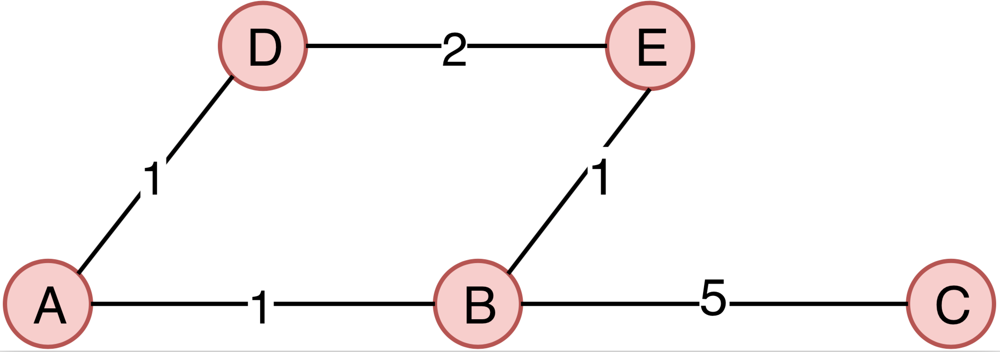

# NetworkShortestPath
Find the shortest path between two nodes or between two group of nodes on a pre-defined network.

Given a weighted undirected network, as example above, this software can help:
- Find out the shortest path between 2 nodes.
- Calculate the average shortest path between two groups of genes.
- Bootstrapping the average shortest path between two groups of genes to form null distribution.


Please check the example in the test directory, the network structure as below figure:


### Find out the path between two nodes.
```
cat test.network.txt | java -jar ../target/NetworkShortestPath-1.0-jar-with-dependencies.jar --task path -g A,C
#output
A       B       1
B       C       5
```

### Calcuate the average shortest path between two groups of genes.
Given two groups of genes, topGenes(T) and KnownGenes(K), the average shortest path between T and K was defined as ```D = average(min_i(K))```. ```min_i(K)``` the minimal distance of gene ```i``` in ```T``` to any gene from ```K```, ```i``` iterating genes in ```T```.

```
# known.g.txt = {A,D}
# top.g.txt   = {C,E}
cat test.network.txt | java -jar ../target/NetworkShortestPath-1.0-jar-with-dependencies.jar -k known.g.txt -i top.g.txt
# output:
4
```

### Bootstrapping the average shortest path between two groups of genes.
Fixed the KnownGenes, and random pick ```-r``` number of genes from the gene pool(excluding genes from KnownGenes) to forming the topGenes(T), and calculate the average shortest path between them as previous section. Repeat this process ```-b``` times. This is very useful to generate the null distribution for statistical testing. 
```
cat test.network.txt | java -jar ../target/NetworkShortestPath-1.0-jar-with-dependencies.jar -k known.g.txt -r 2 -b 2
# output, this output is random as random picking genes.
3.5
4
```


#### Tested environment
java version 1.8, should work with version >= 1.8

#### Credit
The shortest path searching algorithm was by the (Dijkstra's algorithm)[https://en.wikipedia.org/wiki/Dijkstra%27s_algorithm], taking the java implementation from (Princeton University)[https://algs4.cs.princeton.edu/44sp/DijkstraUndirectedSP.java.html]. If you use this program please cite:
1. Our paper
2. Sedgewick, R, Wayne, K: Algorithms, Addison-Wesley 2011.
